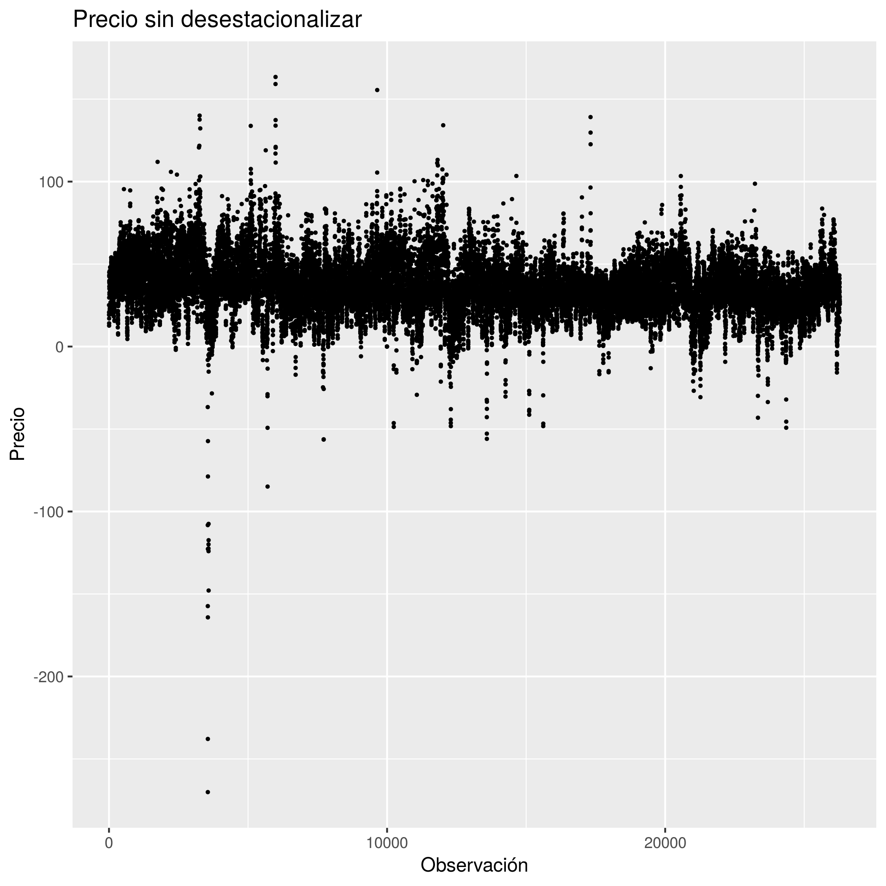

Cargamos algunas librerías útiles:

```{r, results = F, message = F}
library(tidyverse)
library(gghighlight)
library(glue)
library(here)
```

Leemos los datasets:

```{r}
source(here("R/leer_datasets.R"))

deseason_prices <- read_dataset("data/deseasonalized_prices.csv")
raw_prices <- read_dataset("data/intraday_prices.cleaned.csv")
```

Exploramos los datos:

```{r}
fig <-
  raw_prices %>%
  ggplot() +
    geom_point(aes(x = obs_id, y = price), size = .5) +
    labs(
      title = "Precio sin desestacionalizar",
      x = "Observación",
      y = "Precio")

print(fig)

ggsave(here("results/precio_sin_desestacionalizar.png"))
```




```{r, message = F}
fig <-
  deseason_prices %>%
  ggplot() +
  geom_point(aes(x = obs_id, y = price), size = .5) +
  labs(
    title = "Precios desestacionalizados",
    x = "Observación",
    y = "Precio")

ggsave(here("results/precios_desestacionalizados.png"))
```

```{r}
media <- mean(deseason_prices$price)
varianza <- var(deseason_prices$price)
desvio <- sd(deseason_prices$price)
umbral <- 4 # en desvíos
```

Definimos un "pico de precios" como precios mayores a `r umbral`

```{r}
deseason_prices$price_z <- (deseason_prices$price - media) / desvio

fig <-
  deseason_prices %>%
  ggplot() +
  aes(x = obs_id, y = price_z) +
  geom_point(size = .5) +
  gghighlight(abs(price_z) >= umbral) +
  geom_hline(yintercept = umbral, color = "RoyalBlue", alpha = .5) +
  geom_hline(yintercept = -umbral, color = "RoyalBlue", alpha = .5) +
  labs(
    title = "Precios desestacionalizados y estandarizados",
    subtitle = glue("Picos de precios a partir de ±{umbral} desvíos estándar"),
    x = "Observación",
    y = "Precio") +
  scale_y_continuous(breaks = seq(-25, 10, 5))

print(fig)

ggsave(here("results/precios_desestacionalizados_y_estandarizados.png"))
```


```{r}

```

Agrupamos el dataset de a cada 24 observaciones, para generar un promedio de 
precio por día:

```{r}
for (i in 1:(nrow(raw_prices) / 24)) {
  start <- 24 * (i - 1) + 1
  end <- 24 * (i)
  raw_prices[start:end, "day"] = i
}

raw_prices_daily <-
  raw_prices %>%
  group_by(day) %>%
  summarise(price = mean(price))
```

```{r}
raw_prices_daily %>%
  ggplot() +
  geom_point(aes(x = day, y = price), size = .5)
```


